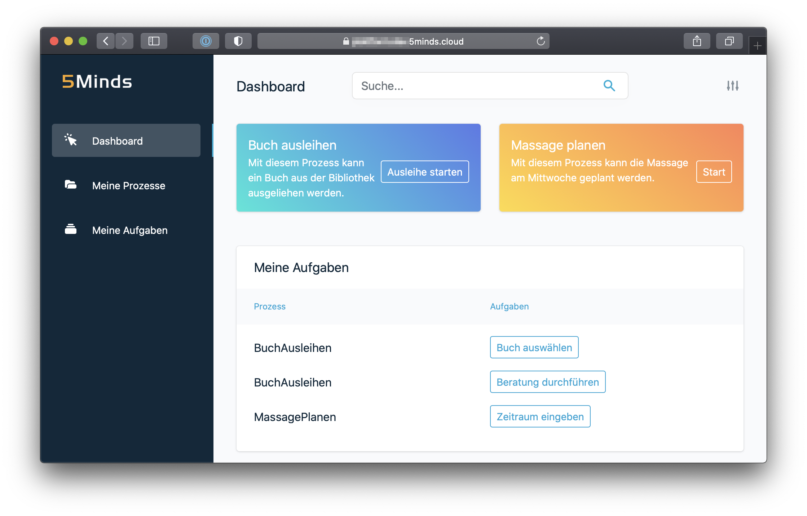

# Folge 24

## Atlas UI

E24 - 5Minutes - Atlas UI

## Folgen Beschreibung

In der 24. Folge unseres 5Minds Podcast geht es um unsere Atlas UI eine Komponente der Atlas Platform das neue Produkt der 5Minds.

Die AtlasUI ist eine Rahmenanwendung benutzerorientierte Applikationen. Sie dient als Schnittstelle zwischen Benutzer und Prozess.

In der Rahmenanwendung werden bereits alle notwendigen Infrastruktur Themen wie z.B. OAuth behandelt. Dies erlaubt
es Entwicklern sich auf die wichtigen Teile ihrer Anwendung zu konzentieren.

Benutzer starten über die AltasUI Prozesse und bearbeiteten Aufgaben, welche während der Ausführung anfallen.

Aufgaben können in der AltasUI über DynamicForm oder CustomForm hinterlegt werden. Mit DynamicForms können schnell
einfachere Formulare erstellt werden, diese bieten einfache Eingabefelder. CustomForms ermöglichen es hingegen,
die Formulare mit beliebigen Frameworks zu gestallten.

## Link zur Episode

Folgt...
