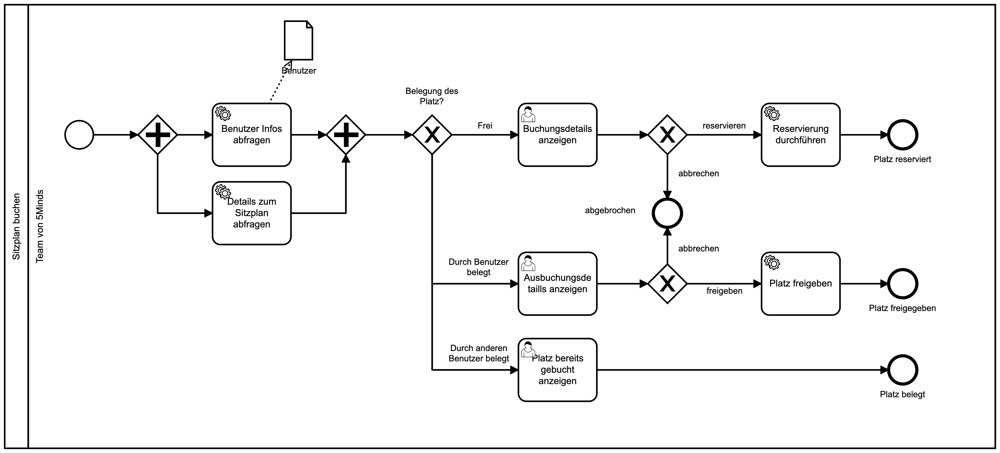

# Folge 36

## Der 5Minds Sitzplan

E36 - 5Minutes - Der 5Minds Sitzplan

## Folgen Beschreibung

In der 36. Folge unseres 5Minds Podcasts sprechen wir mit Paul Heidenreich über unser neues Sitzplan System.
Paul erklärt uns, wie sich unsere händisch gepflegte Google Tabelle schrittweise zu einer
prozessbasierten Software verwandelt hat.

Hier der angesprochene Prozess im Detail:

## Link zur Episode

Folgt...
